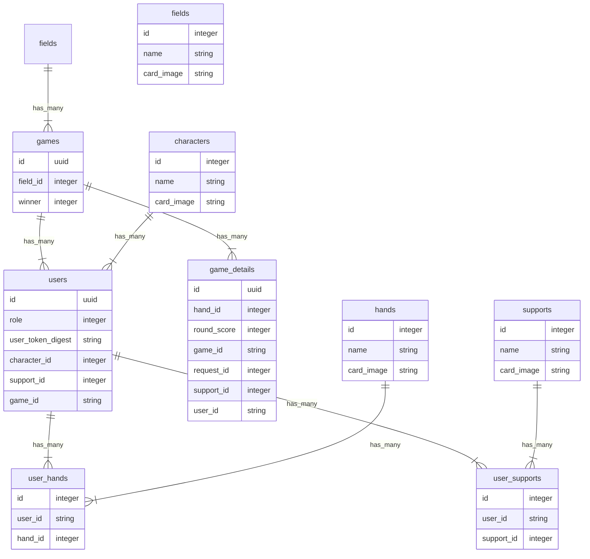

# 旧約じゃんけん

## ER図

```mermaid
erDiagram
users ||--|{ user_hands: has_many
users ||--|{ user_supports: has_many
users {
  id uuid
  role integer
  user_token_digest string
  character_id integer
  support_id integer
  game_id string
}

games ||--|{ users: has_many
games ||--|{ game_details: has_many
games {
  id uuid
  field_id integer
  winner integer
}

game_details {
  id uuid
  hand_id integer
  round_score integer
  game_id string
  request_id integer
  support_id integer
  user_id string
}

fields　||--|{　games: has_many
fields {
  id integer
  name string
  card_image string
}

characters ||--|{ users: has_many
characters {
  id integer
  name string
  card_image string
}

hands ||--|{ user_hands: has_many
hands {
  id integer
  name string
  card_image string
}

user_hands {
  id integer
  user_id string
  hand_id integer
}

supports ||--|{ user_supports: has_many
supports {
  id integer
  name string
  card_image string
}

user_supports {
  id integer
  user_id string
  support_id integer
}
```
